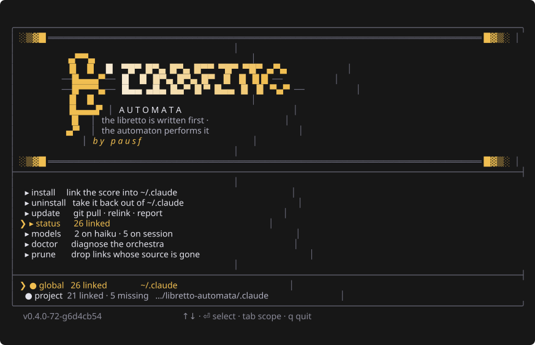

<div align="center">

# 𝄞 Libretto Automata

**The libretto is written first. The automaton performs it.**

[](https://go.dev)
[](https://github.com/charmbracelet/bubbletea)
[](https://github.com/charmbracelet/lipgloss)
[](https://claude.com/claude-code)
[](https://github.com/ankitpokhrel/jira-cli)
[](LICENSE)
[](.github/workflows/gates.yml)



*The panel — real terminal output, captured from the binary. `tab` switches where it acts.*

</div>

---

An 18th-century automaton was a machine that played music by reading a score. A human
wrote the notes; the machine executed them. It never improvised — it did exactly what
the paper said. **If the performance was wrong, the paper was wrong.**

That is how this works. You write the spec. The agent performs it. When the output is
bad, you fix the libretto, not the automaton.

## What you get

Two things, and the first one is the point:

| | |
|---|---|
| **The payload** | an eight-phase spec-driven flow for Claude Code, as skills and commands |
| **The CLI** | a Go binary that symlinks the payload into `~/.claude` |

What changes in practice: you say what you want, and before any code exists you get a
**contract** — what "done" means, what is deliberately out of scope, and how each promise
will be proven. You approve that, then a plan, then the work happens against it. A fresh
reviewer that saw none of the session checks the result, and the last question is always
whether to push.

Links are made **per item, never per directory**, so this coexists with anything else
installed into `~/.claude`. Anything already there that this tool did not create is left
untouched and reported.

## Install

Two commands, plus [Go 1.26+](https://go.dev/dl/).

```bash
go install github.com/pausf/libretto-automata/cmd/libretto@latest

libretto install   # symlink every item into ~/.claude
```

**That is the whole install.** No tarball to fetch, no bootstrap step. Check it landed:

```bash
libretto status    # every item's state, changes nothing
```

### Updating

```bash
libretto update
```

Installs the newest version and relinks, so a release that *adds* a skill arrives linked.

The panel also tells you when a newer version exists, checked once a day and silent when it
cannot check.

### From a checkout instead

For working *on* the payload rather than with it:

```bash
git clone git@github.com:pausf/libretto-automata.git ~/gitrepos/libretto-automata
cd ~/gitrepos/libretto-automata

make build      # stamps the version from git describe
make link       # puts `libretto` on your PATH via ~/.local/bin
```

`update` pulls there instead of downloading, and the tree you are standing in is the
installation — [why](docs/DESIGN.md#why-the-payload-is-not-compiled-into-the-binary).

## Your first run

The CLI is installed and you will not type it again for a while. **The flow lives inside
Claude Code** — what follows are slash commands, not shell commands.

1. **Say what you want.**

   ```
   /libretto-flow add a --json flag to status
   ```

   It reads the request, names the change, and writes it down before anything else. Hand it
   a tracker key instead — `/libretto-flow EUCAR-1234` — and it reads the ticket.

2. **It stops at the spec.** You get the contract: outcomes, what is out of scope, the
   constraints it found in your code, and the test that will prove each promise. **This is
   the cheap place to disagree** — a wrong sentence here costs a line, and the same
   misunderstanding costs a day once it is code.
3. **It stops at the plan.** An ordered checklist, with what can start now.
4. **It builds**, marking boxes as it goes, and leaves a proportionate test behind — one
   runnable check for real logic, none for a one-liner with no logic in it.
5. **A fresh reviewer reads the result.** It saw none of the session that wrote the code,
   which is the entire point, and it re-runs every proof the change touched.
6. **It reports** in the spec's own terms, including what it deliberately did not build and
   what would bring it back.
7. **It asks once about pushing.** That answer is always yours.

Those are the three places it waits, and each one is a question your terminal puts in front
of you — not a line at the bottom of a report. **`/libretto-attacca` answers all three in
advance**, for when you want the whole thing to run without you.

Nothing else to learn to start. The rest is knowing which door to use:

```bash
/libretto-status              # what is in flight and what is queued — changes nothing
/libretto-flow                # find the work and take it through the phases
/libretto-flow EUCAR-1234     # …starting from a ticket
/libretto-queue               # capture ideas, one after another, and build none of them
/libretto-next                # take the oldest queued idea into the flow
/libretto-review <pr-url>     # review a PR/MR in a workspace that restores itself
/libretto-attacca             # the same flow, without stopping — straight to a pushed PR
```

**`/libretto-attacca` answers those stops in advance.** Same phases, same spec, same plan,
same report — it just does not wait for you at any of them, and it ends with the branch
pushed and the request open. What it will not do is answer a *gate*: a failing check still
stops it where it stands, and it never merges, tags or releases. `attacca` is what a score
writes to mean *go on to the next movement without pausing*.

**The flow does not begin at a tracker.** Phase 1 asks three sources in order — a change
already in flight, a tracker key or URL, and what you said — and the order is the point:
starting something new while a change sits half-finished is how the half-finished thing
gets abandoned.

| | Phase | Skill |
|---|---|---|
| 1 | find the work — in flight, tracker, or asked for | `find-work` |
| 0·2·3 | does a spec even need to exist · the six pillars · one per subtask | `write-spec` |
| 5 | the plan — live state, one writer | `write-plan` |
| 6 | build, with proportionate checks | `build-and-check` |
| 7 | present, including what was left out | `present-work` |
| 8 | commit, and make the spec true again | `record-work` |

Three rules hold at **every** phase, not one of them:

- **ask** — with a recommended option, real alternatives, and room to answer otherwise
- **commit** — per task, so a bisect lands somewhere meaningful
- **evidence** — nothing is true until it has been observed

## Commands

| | |
|---|---|
| `libretto` | the panel — needs a terminal |
| `libretto status` | every item's state. Read-only, always. |
| `libretto install` | link everything. Idempotent; non-zero exit if anything was skipped. |
| `libretto uninstall` | show what this repo installed here — **changes nothing** |
| `libretto uninstall --yes` | take it back out |
| `libretto update` | install the newest version and relink — or pull, in a checkout |
| `libretto doctor` | what needs attention, plus what the payload expects here |
| `libretto prune` | show links whose source is gone — **changes nothing** |
| `libretto prune --yes` | remove them |
| `libretto preview` | print the panel once, no TUI |
| `libretto models` | which model each agent runs on. Read-only. |
| `libretto models set <model> <agent>…` | declare it; `--all` for every agent |

`prune` and `uninstall` are both dry by default — they change nothing until `--yes`. They
are **not the same command**: prune removes links whose item is gone, uninstall removes
links that are working.

### Choosing a model per agent

Not every agent needs the same model. The review lenses that pattern-match over prose —
design, tests — do the job on a cheap one; the lens looking for what an attacker can
reach should not.

```bash
libretto models                                  # who runs on what
libretto models set haiku review-lens-design review-lens-tests
libretto models set default work-reviewer        # back to the session's model
```

The panel has the same thing behind its `models` row: mark agents with `space`, or all
of them with `a`, pick a model with `m`.

`models` acts on **the agents of the destination you name** — `~/.claude/agents` under
`--global`, `<cwd>/.claude/agents` under `--project`. Every agent there is listed and
editable, not just the ones this repository ships.

The values are **aliases**. The listing shows what each one resolves to, and when that was
last checked:

```
models available (aliases; versions as of 2026-08):
  default                 the session's model — whatever you are running
  haiku      Haiku 4.5    cheapest; fine for pattern-matching over prose
  sonnet     Sonnet 5     the everyday working model
  opus       Opus 5       most capable; Max plans, metered on Pro
```

### Where it installs

| | |
|---|---|
| `--global`, `-g` | `~/.claude` — **the default** |
| `--project`, `-p` | `<this directory>/.claude` |

A project-local install keeps a flow scoped to one repository without editing the
configuration every other project shares. In the panel, the strip shows both
destinations and `tab` switches which one the keys act on — the active one is marked
`◉` in gold.

Passing both flags is an error.

### The five states

`status` reports one of these per item, per target:

| State | Meaning | Remedy |
|---|---|---|
| `linked` | our symlink, right destination | none |
| `missing` | in the repo, absent from the target | `install` |
| `wrong target` | our symlink, wrong destination | `install` repoints it |
| `conflict` | something foreign in the way | **none** — reported, never touched |
| `stale` | our symlink with no item behind it | `prune` |

### Environment

| | |
|---|---|
| `CLAUDE_HOME` | Claude Code's root instead of `~/.claude`. What makes the test suite safe. |
| `LIBRETTO_ROOT` | the repo location, instead of deriving it from the binary |
| `LIBRETTO_ASCII=safe` | swap the clef's quadrant glyphs for half blocks |
| `LIBRETTO_THEME` | `dark` or `light`, instead of detecting |
| `COLUMNS` | layout width when stdout is not a terminal |

There is no configuration file. A value that never varies is not configuration.

## Learn more

| | |
|---|---|
| [docs/FLOW.md](docs/FLOW.md) | the eight phases, where the flow stops and why only there |
| [docs/DESIGN.md](docs/DESIGN.md) | why it is built this way — symlinks, no `--force`, the palette |
| [`.agents/specs/`](.agents/specs/) | the specification, one directory per capability |
| [AGENTS.md](AGENTS.md) | working *on* this repository: the gates, the commit rules, versioning |
| [THIRD-PARTY.md](THIRD-PARTY.md) | the vendored skills, their licences and versions |

## Standing on other people's work

Seven skills **ship with this repository**, so the flow works on a machine that has
nothing else installed. Copied unmodified, licence and version recorded in
[THIRD-PARTY.md](THIRD-PARTY.md):

- [**obra/superpowers**](https://github.com/obra/superpowers) — `writing-plans`,
  `test-driven-development`, `using-git-worktrees`. The flow's own skills are thin
  because they delegate to these, and a thin skill whose delegate is missing is not
  thin, it is broken.
- [**DietrichGebert/ponytail**](https://github.com/DietrichGebert/ponytail) —
  `ponytail`, `ponytail-debt`. Decides how much gets built: the ladder runs from
  *does this need to exist at all?* down to *only then, the minimum that works*, and
  it carries the list of things that are never trimmed: trust boundaries, data loss,
  security, accessibility. The flow invokes it in phase 2, on requirements, because
  that is where removing work is cheapest.
- [**JuliusBrussee/caveman**](https://github.com/JuliusBrussee/caveman) — `caveman`,
  `caveman-commit`. Decides how much gets said. Compresses prose; ponytail compresses
  what gets built. No overlap.

Shipped is not required: nothing fails without them, and they prune like any other
item. Only what the flow calls by name is vendored — the rest of both plugins,
including always-on hook mode, stays with the upstream plugins, and the two coexist
by namespace.

## Not managed here

`CLAUDE.md` and `settings.json`. Other tooling rewrites regions of those files, so they
stay hand-managed. Linking them would start a fight this tool cannot win.

## Licence

[MIT](LICENSE). Vendored items keep their own — see [THIRD-PARTY.md](THIRD-PARTY.md).
